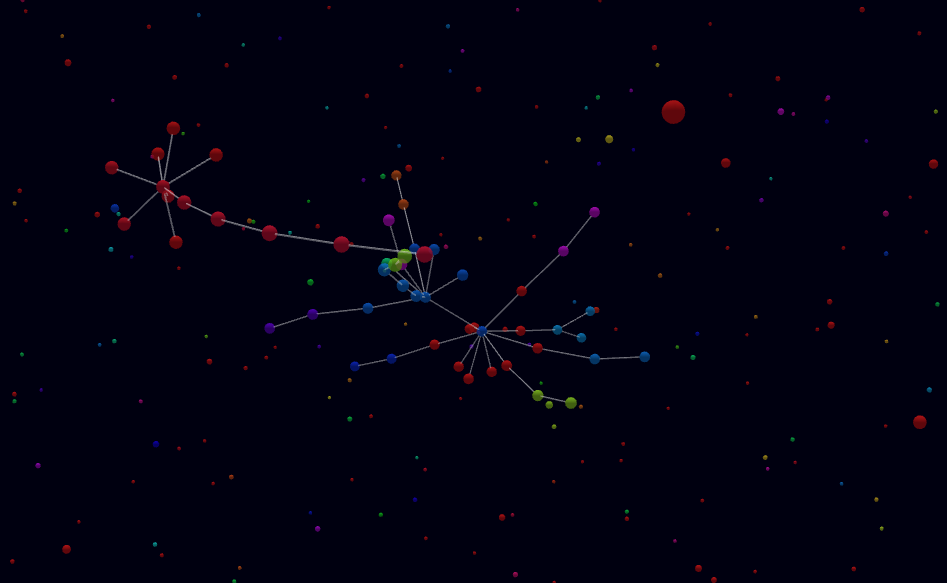

# Product topology

## Starting project:
1. Below command starts the server on port 8181.

```
npm run start
```

2. Simply open the URL: http://localhost:8181



## Versions and Envs used
1. Node     -   v16.3.0
2. Npm      -   8.19.2
3. OS       -   Mac
4. Browser  -   Chrome
